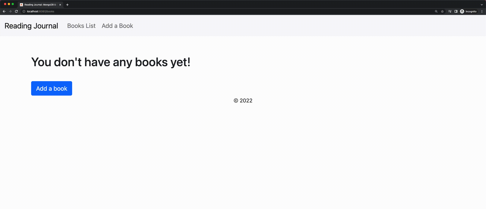

# Reading Journal: MongoDB & CodeIgniter CRUD Tutorial

This is a 'Reading Journal' web application built with MongoDB and CodeIgniter. You can also follow the step-by-step [tutorial](https://www.mongodb.com/compatibility/mongodb-and-codeigniter) for building this application.



## Setup

To run this application, follow the instructions below.

### Cloning the Repository

Grab the code from Github and navigate to the cloned directory:

```
git clone git@github.com:mongodb-developer/mongodb-codeigniter.git
cd mongodb-codeigniter
```

### Installing the MongoDB PHP Driver

The [MongoDB PHP Driver](https://www.mongodb.com/docs/drivers/php/) consists of two components: the extension and the library.

To install the extension and load it in your `php.ini` file, run the following commands:

```
pecl install mongodb
echo "extension=mongodb.so" >> `php --ini | grep "Loaded Configuration" | sed -e "s|.*:\s*||"`
```

Then, install the library with [Composer](https://getcomposer.org/):

```
brew install composer
composer require mongodb/mongodb
```

### Environment Variables

Copy `env` to `.env` and replace `ATLAS_URI` with your own [Atlas URI connection string](https://docs.atlas.mongodb.com/getting-started/). Make sure you also replace the username and password placeholders with your own credentials.

### Running the Application

To start the local development server, run the following command:

```
php spark serve
```

Open the browser on http://localhost:8080/.

## Notable Files

The application consist of a few notable building blocks:

### MongoDB Connection

The `DatabaseConnector` class located in `app/Libraries/DatabaseConnector.php` is responsible for connecting to the MongoDB database. It gets the connection string and database name from the `.env` file. Then, it connects to the database using the [MongoDB PHP Driver](https://www.mongodb.com/docs/drivers/php/).

### Books Model

The `BooksModel` class located in `app/Models/BooksModel.php` implements the CRUD (Create, Read, Update, Delete) functionality for the `books` collection. 

### Books Controller

The `Books` class located in `app/Controllers/Books.php` is the controller for the books pages in our application. It's responsible for fetching data through the `BooksModel` and passing it to the view. It also handles the form submission and validates the form data.

### Routes

The application routes are configured in the `app/Config/Routes.php` file.

## Disclaimer

Use at your own risk; not a supported MongoDB product

